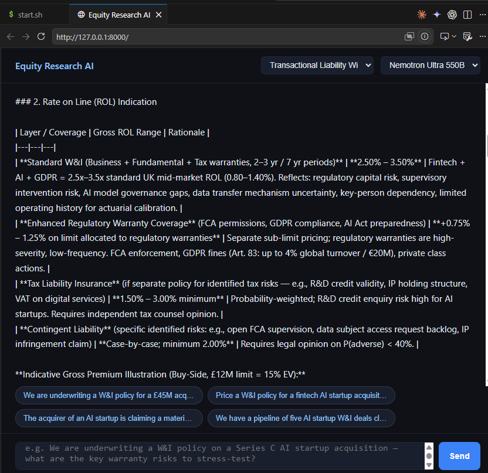

# Equity Research Agent

An AI-powered equity research agent that produces institutional-grade research reports for any publicly traded stock. Powered by **nvidia/nemotron-3-ultra-550b-a55b** (default) via OpenRouter and the **Financial Modeling Prep (FMP) stable API**.

---

## Actuarial Agents — Corgi Insurance for AI Startups

The platform ships two actuarial specialist agents in `agents/`, designed for **insurance and reinsurance of AI startups** in industrial settings. Each agent is backed by a structured `.md` definition file that encodes deep domain expertise as a durable system prompt — selectable from the chat UI dropdown or callable directly via API.

### Chief of Regulatory Capital Modelling

**Agent file:** `agents/chief-capital-modelling-agent.md`



The Chief Capital Modelling agent operates as a Fellow-level actuary with 15+ years of Solvency II Internal Model experience. It provides quantitative capital analysis across the full lifecycle of an AI insurance portfolio: SCR calibration, reinsurance optimisation, stress testing, and strategic transaction support.

**Intended use:** Capital teams at AI-focused insurers and reinsurers requiring rigorous, regulator-ready quantitative analysis — board presentations, ORSA submissions, or underwriting decision support.

**Industrial query examples:**

```
We are writing AI model failure liability for enterprise SaaS startups with no
credible loss history. How should we calibrate the SCR frequency-severity
distribution under Solvency II Pillar 1, and what EVT tail-fitting approach
would you recommend?
```

```
Our AI errors & omissions book covers 200 Series B/C startups at £150M GWP.
Design a CAT XL reinsurance programme that maximises SCR relief within a 15%
net cost-of-capital constraint — include attachment point, limit, and
reinstatement recommendations.
```

```
Model a systemic AI infrastructure failure scenario: a major cloud provider
LLM API outage affects 80% of our insured AI startup portfolio simultaneously.
Quantify the aggregate PML, SCR uplift, Solvency II coverage ratio impact,
and credible management actions.
```

```
We want to launch an AI product liability line targeting Series A startups at
£1M–£5M limit. Using Euler allocation, what capital per £1M of limit deployed
justifies a RORAC above our 12% hurdle rate, and how does this compare against
our existing cyber book?
```

**Call via API:**
```bash
curl -s -X POST "http://localhost:8000/agents/chief-capital-modelling-agent/chat/stream" \
  -H "Content-Type: application/json" \
  -d '{
    "message": "Our AI errors & omissions book covers 200 Series B/C startups at £150M GWP. Design a CAT XL reinsurance programme that maximises SCR relief within a 15% net cost-of-capital constraint — include attachment point, limit, and reinstatement recommendations.",
    "model": "nemotron"
  }'
```

---

### Transactional Liability — Warranty & Indemnity Underwriter

**Agent file:** `agents/transactional-liability-wi-agent.md`

The W&I agent operates as a senior Warranty & Indemnity underwriter with deep expertise in AI startup M&A transactions. It handles SPA warranty review, ROL pricing, MRC contract certainty documentation, and portfolio accumulation management for tech-sector transactional liability books.

**Intended use:** W&I underwriting teams assessing AI startup acquisitions — deal triage, policy structuring, claims investigation, and reinsurance placement for transactional liability portfolios.

**Industrial query examples:**

```
We are underwriting a W&I policy for a £45M acquisition of an AI data analytics
startup. The SPA includes IP ownership warranties and data privacy representations.
What are the three highest-severity warranty risks and how should we structure
the tipping basket?
```

```
Price a W&I policy for a fintech AI startup acquisition at £80M enterprise value.
The target processes personal financial data under GDPR. Provide a ROL indication,
recommended retention, and key exclusions given the regulatory exposure.
```

```
The acquirer of an AI startup is claiming a material warranty breach six months
post-close — the training data allegedly included unlicensed third-party content,
creating IP infringement exposure. Walk through the claims investigation process
and reserve methodology.
```

```
We have a pipeline of five AI startup W&I deals closing this quarter totalling
£220M in aggregate limit. Assess the portfolio accumulation risk, identify
correlated exposures across the book, and recommend a reinsurance structure
to manage peak aggregate loss.
```

```
An acquirer is completing a £35M acquisition of an EU AI Act Tier-2 high-risk
AI system provider to the financial sector. The SPA contains representations
on regulatory compliance and conformity assessments. With EU AI Act enforcement
six months post-close, quantify the warranty exposure, structure a W&I policy
with appropriate sublimits for regulatory non-compliance, and advise whether a
separate regulatory liability top-up cover is warranted.
```

```
We are underwriting a £60M W&I policy on the acquisition of an AI-powered
credit underwriting platform. Due diligence identified that 30% of the training
dataset was sourced from third-party vendors under licences that pre-date the
current use case. The seller is unwilling to provide specific indemnity. Advise
on how to price the residual IP warranty exposure, appropriate policy sublimits,
and whether a synthetic data clean-up covenant should be required as a condition
of binding.
```

**Sample output:** [W&I policy — Fintech AI Startup Acquisition (£80M EV)](sample-outputs/wi-fintech-ai-startup-nemotron-2026-06-24.md) — full ROL indication, retention, exclusions schedule, and pre-bind conditions (generated by Nemotron Ultra 550B).

**Call via API:**
```bash
curl -s -X POST "http://localhost:8000/agents/transactional-liability-wi-agent/chat/stream" \
  -H "Content-Type: application/json" \
  -d '{
    "message": "Price a W&I policy for a fintech AI startup acquisition at £80M enterprise value. The target processes personal financial data under GDPR. Provide a ROL indication, recommended retention, and key exclusions.",
    "model": "nemotron"
  }'
```

---

### Adding new agents

Drop any `.md` file into `agents/` — it is automatically registered at server startup and appears in the chat UI dropdown. No code changes required.

```bash
cp my-new-agent-definition.md Equity-Research-agent/agents/
# restart server — agent appears in dropdown immediately
```

---

## What it does

Given a ticker symbol, the agent:
1. Calls 21 FMP data endpoints in parallel (financials, valuation, analyst ratings, peers, global indices + VIX, SEC filings, ETF holdings/sectors/asset exposure, and more)
2. Runs an agentic loop where the model autonomously decides what data to gather
3. Synthesizes all data into a comprehensive 10-section research report with a BUY/HOLD/SELL rating and 12-month price target
4. Streams reasoning tokens internally — the model thinks before it writes

## Report sections

1. Executive Summary (rating + price target)
2. Company Overview
3. Financial Performance (4-year trend tables)
4. Balance Sheet & Capital Structure
5. Valuation Analysis (DCF + peer multiples table)
6. Growth Outlook
7. Competitive Position (peer comparison table)
8. Insider Activity & Analyst Sentiment
9. Risk Factors
10. Recent Developments

## Quick start

### Terminal
```bash
# 1. Install Node dependencies
npm install

# 2. Copy and fill in your API keys
cp .env.example .env

# 3. Run a research report
set -a && source .env && set +a
node agent.js NVDA --save --model=nemotron
```

Reports are saved to `output/NVDA-research-YYYY-MM-DD.md`. Progress logs stream to stderr; the report goes to stdout.

### Chat UI (WSL / Linux)
```bash
# Start the FastAPI server (kills any existing process on port 8000 first)
kill $(lsof -t -i:8000) 2>/dev/null; bash start.sh
```

Then open **http://localhost:8000/** in your browser. Type a question in the input field and press Enter — responses stream token by token. A live timer shows how long the model has been processing. Use the **Cancel** button to abort at any time.

To run a full equity research report via the API:
```bash
curl -s -X POST "http://localhost:8000/research/NVDA?model=nemotron&save=true"
```

---

## Setup

**1. Install dependencies**
```bash
npm install
```

**2. Set environment variables**
```bash
cp .env.example .env
# Edit .env and fill in your API keys
```

You need two API keys:
- `OPENROUTER_API_KEY` — from [openrouter.ai/keys](https://openrouter.ai/keys)
- `FMP_API_KEY` — from [financialmodelingprep.com](https://financialmodelingprep.com/developer/docs)

## Usage

### Model selection

The default model is Nemotron (reasoning + streaming). Switch with `--model`:

```bash
node agent.js AAPL --model=nemotron   # default — reasoning, streaming
node agent.js AAPL --model=laguna     # faster, no reasoning tokens
node agent.js AAPL --model=nvidia/nemotron-3-ultra-550b-a55b:free  # full ID
```

### Single stock

```bash
# Using run.sh (recommended — auto-loads .env)
bash run.sh AAPL
bash run.sh NVDA --save        # saves report to output/NVDA-research-YYYY-MM-DD.md
bash run.sh MSFT --save        # saves and prints

# Or manually with env exported
set -a && source .env && set +a
node agent.js AAPL
node agent.js NVDA --save
```

### Multiple stocks — sequential

Run one after another, each saves its own `.md` file:

```bash
for ticker in AAPL NVDA MSFT GOOGL; do
  bash run.sh $ticker --save
done
```

### Multiple stocks — parallel

Run all at the same time in the background:

```bash
bash run.sh AAPL --save &
bash run.sh NVDA --save &
bash run.sh MSFT --save &
wait && echo "All reports done"
```

### Redirect output

Progress logs go to `stderr`, the report goes to `stdout` — so you can split them:

```bash
# Save report to file, watch progress in terminal
node agent.js AAPL --save 2>/dev/null > aapl-report.md

# Save both separately
node agent.js AAPL 2>progress.log > aapl-report.md
```

## FastAPI server

Serves the agent as a REST API with a built-in chat UI.

**Start (WSL / Linux)**
```bash
# First run or after port conflict
kill $(lsof -t -i:8000) 2>/dev/null; bash start.sh
```

`start.sh` installs Python deps, creates/repairs the venv, and starts uvicorn. On subsequent runs it auto-kills any existing process on port 8000.

| URL | Description |
|-----|-------------|
| `http://localhost:8000/` | Chat UI — input field with streaming responses |
| `http://localhost:8000/docs` | Interactive API docs |
| `POST /research/{ticker}` | Full equity report as JSON |
| `GET /research/{ticker}/stream` | SSE stream — tool call progress + report |
| `POST /indices` | Global indices snapshot |
| `GET /output` | List saved reports |
| `GET /output/{filename}` | Fetch a saved report |
| `POST /chat/stream` | Direct chat completions (SSE) |
| `GET /agents` | List available agent definitions |
| `POST /agents/{name}/chat/stream` | Chat with a named specialist agent (SSE) |
| `GET /sec-filings` | Latest 8-K filings by date range *(premium FMP)* |
| `GET /sec-filings/form-type` | Any SEC form type — 10-K, 13D, 13F, etc. *(premium FMP)* |
| `GET /sec-filings/search` | Search SEC filers by company name *(premium FMP)* |
| `GET /etf/holdings` | Full holding-level breakdown of an ETF *(premium FMP)* |
| `GET /etf/sector-weightings` | Sector allocation weights for an ETF *(premium FMP)* |
| `GET /etf/asset-exposure` | Asset class allocation (equities/bonds/cash/REITs) *(premium FMP)* |
| `GET /etf/info` | ETF metadata — expense ratio, AUM, benchmark, inception *(premium FMP)* |
| `GET /symbols` | Hardcoded list of FMP free-tier supported symbols |
| `GET /health` | Server health and available models |

**Check Supabase DB is reachable (WSL)**
```bash
# 1. DNS resolves?
getent hosts db.phmzdhbyliiqtwrltqmo.supabase.co

# 2. Port open? (use -4 to force IPv4 if WSL returns IPv6 error)
nc -4 -zv db.phmzdhbyliiqtwrltqmo.supabase.co 5432

# 3. If IPv6 is causing "Network is unreachable", fix permanently
echo "precedence ::ffff:0:0/96 100" | sudo tee -a /etc/gai.conf

# 4. Confirm pool connected — look for this line after bash start.sh
# [db] Supabase pool connected ✓
```

See [`SUPABASE.md`](SUPABASE.md) for full diagnostics, psql test, and SQL queries.

**Check OpenRouter credits**
```bash
# Reads OPENROUTER_API_KEY from .env automatically
node check-credits.js
```

Output:
```
OpenRouter API Key Info
═══════════════════════════════════
Label          : (none)
Usage (USD)    : $0.0000
Credit limit   : unlimited
Remaining      : unlimited
Rate limit     : -1 req / minute
Is free tier   : true
═══════════════════════════════════
```

> Free tier models (`:free` suffix) require a deposited balance ≥ $10 to unlock 1,000 req/day. With $0 balance, requests queue and may time out after 7–10 minutes.

## Test script

`test.js` validates both connections (OpenRouter + FMP) without running a full report:

```bash
set -a && source .env && set +a

# Tool call test (AAPL quote via Laguna) + streaming overview of AAPL and NBIS
node test.js

# Custom ticker for tool call section
node test.js TSLA
```

Output shows:
- OpenRouter response time
- `finish_reason` and tool call JSON
- Live FMP quote data
- Streamed investment overview for AAPL and NBIS with token usage + reasoning token count

## How it works

```
User: "Research AAPL"
  ↓
OpenRouter (nvidia/nemotron-3-ultra-550b-a55b:free — default)
  ↓ tool_calls (streaming, with reasoning tokens)
FMP /stable API — fetches 21 data points
  ↓ tool results
Model reasons + writes full report
  ↓
Agent prints / saves .md to output/
```

Tool calls within a single turn are executed in parallel with `Promise.all()`. The message history is preserved across turns. The model uses OpenAI-compatible function calling format (`type: 'function'`, `toolCalls`, `finishReason`).

## SEC Filings endpoints

> **Requires a paid FMP plan.** Free-tier keys return `402 Payment Required`. The server passes the 402 through cleanly — no crash. The SEC Filings Analyst chat agent still loads on free tier; it just responds from LLM knowledge rather than live injected filing data.

Three endpoints are available. All use `https://financialmodelingprep.com/stable` as the base and your `FMP_API_KEY` from `.env`.

---

### `GET /sec-filings` — Latest 8-K filings

```
GET http://localhost:8000/sec-filings?from=2024-01-01&to=2024-03-01&page=0&limit=20
```

| Parameter | Type | Default | Description |
|-----------|------|---------|-------------|
| `from` | string | 30 days ago | Start date `YYYY-MM-DD` |
| `to` | string | today | End date `YYYY-MM-DD` |
| `page` | number | 0 | Page index |
| `limit` | number | 20 | Results per page (max 100) |

**Example response:**
```json
{
  "filings": [
    {
      "symbol": "SUNE",
      "cik": "0000022701",
      "filingDate": "2024-03-04 00:00:00",
      "acceptedDate": "2024-03-01 22:47:48",
      "formType": "8-K",
      "hasFinancials": null,
      "link": "https://www.sec.gov/Archives/edgar/data/22701/000089710124000091/0000897101-24-000091-index.htm",
      "finalLink": "https://www.sec.gov/Archives/edgar/data/22701/000089710124000091/pegy240248_8k.htm"
    }
  ],
  "count": 1,
  "params": {
    "from": "2024-01-01",
    "to": "2024-03-01",
    "page": 0,
    "limit": 20
  }
}
```

---

### `GET /sec-filings/form-type` — Any SEC form type

Supports `8-K`, `10-K`, `10-Q`, `13D`, `13F`, `S-1`, `DEF 14A`, and any other SEC form type.

```
GET http://localhost:8000/sec-filings/form-type?formType=13D&from=2024-01-01&to=2024-03-31&limit=20
```

| Parameter | Type | Required | Description |
|-----------|------|----------|-------------|
| `formType` | string | ✓ | SEC form type e.g. `8-K`, `10-K`, `13D`, `13F` |
| `from` | string | | Start date `YYYY-MM-DD` (default: 30 days ago) |
| `to` | string | | End date `YYYY-MM-DD` (default: today) |
| `page` | number | | Page index (default: 0) |
| `limit` | number | | Results per page, max 100 (default: 20) |

**Example response:**
```json
{
  "filings": [
    {
      "symbol": "TSLA",
      "cik": "0001318605",
      "filingDate": "2024-02-14 00:00:00",
      "acceptedDate": "2024-02-13 20:15:32",
      "formType": "13D",
      "hasFinancials": null,
      "link": "https://www.sec.gov/Archives/edgar/data/1318605/000120919124012345/0001209191-24-012345-index.htm",
      "finalLink": "https://www.sec.gov/Archives/edgar/data/1318605/000120919124012345/sc13d.htm"
    }
  ],
  "count": 1,
  "form_type": "13D",
  "params": {
    "formType": "13D",
    "from": "2024-01-01",
    "to": "2024-03-31",
    "page": 0,
    "limit": 20
  }
}
```

**Common `formType` values:**

| Form | What it is |
|------|-----------|
| `8-K` | Material corporate events — M&A, CEO changes, earnings pre-releases |
| `10-K` | Annual report |
| `10-Q` | Quarterly report |
| `13D` | Activist investor schedule — filed when >5% stake acquired with intent to influence |
| `13F` | Institutional holdings disclosure — quarterly snapshot of fund positions |
| `S-1` | IPO registration statement |
| `DEF 14A` | Proxy statement — exec pay, shareholder votes, director elections |

---

### `GET /sec-filings/search` — Search filers by company name

```
GET http://localhost:8000/sec-filings/search?company=Berkshire
```

| Parameter | Type | Required | Description |
|-----------|------|----------|-------------|
| `company` | string | ✓ | Company or entity name |

**Example response:**
```json
{
  "results": [
    {
      "symbol": "BGRY",
      "name": "BERKSHIRE GREY, INC.",
      "cik": "0001824734",
      "sicCode": "3569",
      "industryTitle": "GENERAL INDUSTRIAL MACHINERY & EQUIPMENT, NEC",
      "businessAddress": "140 SOUTH ROAD, BEDFORD MA 01730",
      "phoneNumber": "(833) 848-9900"
    }
  ],
  "count": 1,
  "query": "Berkshire"
}
```

Use this endpoint to resolve a company name to its CIK before pulling specific filings, especially for subsidiaries, holding companies, mutual funds, and foreign private issuers where the ticker is ambiguous.

---

## FMP tools — stable endpoints

All endpoints use `https://financialmodelingprep.com/stable` base URL with `?symbol=` query params.

| Tool | Endpoint | Available |
|------|----------|-----------|
| `get_company_profile` | `/stable/profile` | ✓ |
| `get_stock_quote` | `/stable/quote` | ✓ |
| `get_income_statement` | `/stable/income-statement` | ✓ |
| `get_balance_sheet` | `/stable/balance-sheet-statement` | ✓ |
| `get_cash_flow` | `/stable/cash-flow-statement` | ✓ |
| `get_key_metrics` | `/stable/key-metrics-ttm` | ✓ |
| `get_financial_ratios` | `/stable/ratios-ttm` | ✓ |
| `get_dcf_valuation` | `/stable/discounted-cash-flow` | ✓ |
| `get_analyst_ratings` | `/stable/grades` | ✓ |
| `get_price_target` | `/stable/price-target-consensus` | ✓ |
| `get_peers` | `/stable/stock-peers` | ✓ |
| `get_market_indices` | `/stable/quote` (×9 symbols) | ✓ |
| `get_insider_trades` | — | ✗ requires paid FMP plan |
| `get_recent_news` | — | ✗ requires paid FMP plan |
| `get_sec_filings_8k` | `/stable/sec-filings-8k` | ✗ requires paid FMP plan |
| `get_sec_filings_by_form_type` | `/stable/sec-filings-search/form-type` | ✗ requires paid FMP plan |
| `get_company_sec_filings_search` | `/stable/sec-filings-company-search/name` | ✗ requires paid FMP plan |
| `get_etf_holdings` | `/stable/etf/holdings` | ✗ requires paid FMP plan |
| `get_etf_sector_weightings` | `/stable/etf/sector-weightings` | ✗ requires paid FMP plan |
| `get_etf_asset_exposure` | `/stable/etf/asset-exposure` | ✗ requires paid FMP plan |
| `get_etf_info` | `/stable/etf/info` | ✗ requires paid FMP plan |

## Requirements

- Node.js 18+ (uses native `fetch`)
- Python 3.12+ with `python3.12-venv` (for FastAPI server)
- OpenRouter account — `nvidia/nemotron-3-ultra-550b-a55b:free` (default) or `poolside/laguna-m.1:free`
- FMP API key (free tier: 250 req/day — enough for ~17 full reports/day)

> **OpenRouter free tier note:** `:free` models require a deposited balance (≥ $10) to unlock 1,000 req/day and avoid queue delays. With $0 balance requests may hang; the server applies an 11-minute timeout and surfaces the error in the UI.
