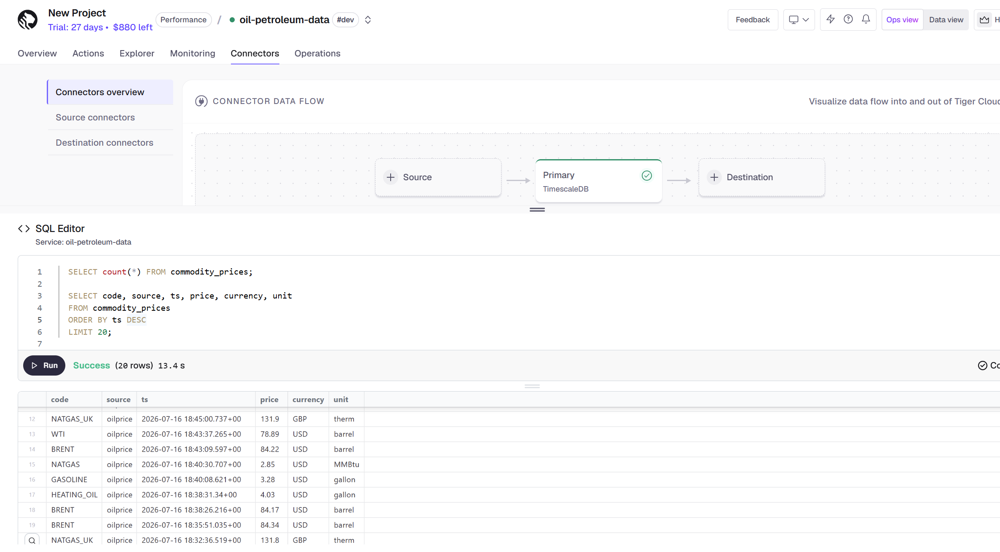

# Inspecting the Tiger Cloud data (Tiger CLI / psql)

How to connect to the Tiger Cloud (TimescaleDB) service and inspect the three
tables: `commodity_prices`, `insider_trades`, and the `marine_ports` columnstore.
Schema/ingest details are in [`TIGER_STREAMING_SQL.md`](TIGER_STREAMING_SQL.md).

## Connect

Open an interactive `psql` session with the Tiger CLI (service id `i2t2hp8zb1`):

```bash
tiger db connect i2t2hp8zb1
```

## List and inspect tables

```psql
\dt                     -- list tables
\d+ commodity_prices    -- columns, indexes, and hypertable/columnstore details
\d+ insider_trades
\d+ marine_ports
```

## View the stored data

### Commodity prices

```sql
SELECT count(*) FROM commodity_prices;

SELECT code, source, ts, price, currency, unit
FROM commodity_prices
ORDER BY ts DESC
LIMIT 20;
```

### Insider trades (important-only)

```sql
SELECT count(*) FROM insider_trades;

SELECT symbol, transaction_type, securities_transacted, price,
       round(value::numeric, 0) AS value, type_of_owner, transaction_date
FROM insider_trades
ORDER BY value DESC
LIMIT 20;
```

### Marine ports (columnstore)

```sql
SELECT code, name, region, major_port, fuel_services, trading_hours
FROM marine_ports
ORDER BY region, code
LIMIT 8;
```

## Check the hypertables and their chunks

```sql
-- hypertable metadata
SELECT *
FROM timescaledb_information.hypertables
WHERE hypertable_name IN ('commodity_prices', 'insider_trades', 'marine_ports');

-- chunks + compression (is_compressed = stored in the columnstore)
SELECT hypertable_name, chunk_name, range_start, range_end, is_compressed
FROM timescaledb_information.chunks
WHERE hypertable_name = 'commodity_prices'
ORDER BY range_start DESC;
```

Swap `commodity_prices` for `marine_ports` to see which port-snapshot chunks the
columnstore policy has compressed (`is_compressed = true`).

## View the continuous aggregates

```sql
-- commodity daily OHLC
SELECT *
FROM commodity_prices_daily
ORDER BY day DESC, code
LIMIT 20;

-- insider daily buy/sell rollup
SELECT *
FROM insider_trades_daily
ORDER BY day DESC, total_value DESC
LIMIT 20;
```

## Exit

```psql
\q
```

## Tiger Cloud Console

You can also open the **oil-petroleum-data** service in the Tiger Cloud Console
and run the same SQL in its built-in SQL editor — no CLI needed.



*A `commodity_prices` query run in the Tiger Cloud Console SQL editor.*
