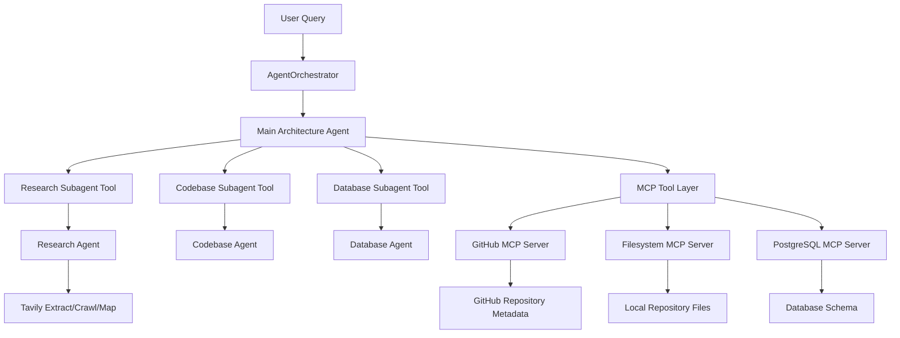

# LangChain Deep Agents MCP MVP

Minimal, production-shaped MVP demonstrating a multi-agent architecture using LangChain, Deep Agents, and MultiServerMCPClient.

## Overview

This repository shows how to compose a main orchestration agent with specialized subagents, Tavily web research skills, and MCP-hosted tools (GitHub, filesystem, PostgreSQL). It uses clean architecture principles: separation of concerns, DI for settings, adapter pattern for MCP clients, and a service layer for orchestration.

**Architecture**



## Folder structure

See the `app/` package for the implementation and `examples/` for runnable scripts.

## Setup

1. Copy `.env.example` to `.env` and fill in credentials.
2. Create a Python 3.11+ venv and install:

```bash
python -m venv .venv
source .venv/Scripts/activate  # Windows: .venv\Scripts\activate
pip install -e ".[dev]"
```

### Neo4j connection

Set the Neo4j connection values in `.env`:

```bash
NEO4J_URI=neo4j+s://your-instance-id.databases.neo4j.io
NEO4J_USERNAME=neo4j
NEO4J_PASSWORD=your-password
NEO4J_DATABASE=neo4j
```

Use `bolt://localhost:7687` for a local Neo4j instance. You can also create a
remote connection to an instance running on an external server or in Neo4j Aura
by setting `NEO4J_URI` to the remote URI, such as
`neo4j+s://your-instance-id.databases.neo4j.io`.

## Run

Run a one-off inspection:

```bash
cp .env.example .env
# fill in secrets and a REPO_PATH
python -m app.main "Inspect this repository and suggest the next implementation steps"
```

Example scripts are available in `examples/`.

## Safety notes
- This MVP performs read-only inspection by default. MCP server commands that could be destructive are disabled by design.
- Do not commit real secrets to the repo.

## Known limitations
- The code provides graceful fallbacks when MCP adapters or deepagents are not installed; in those cases, the agents are stubs.
- Tool invocation that requires running nested event loops may be limited in synchronous wrappers.

## Next steps
- Add integration tests that spin up lightweight MCP servers or mocks.
- Add richer agent prompts and tooling for incremental tasks.

## License
MIT-style (not included).
